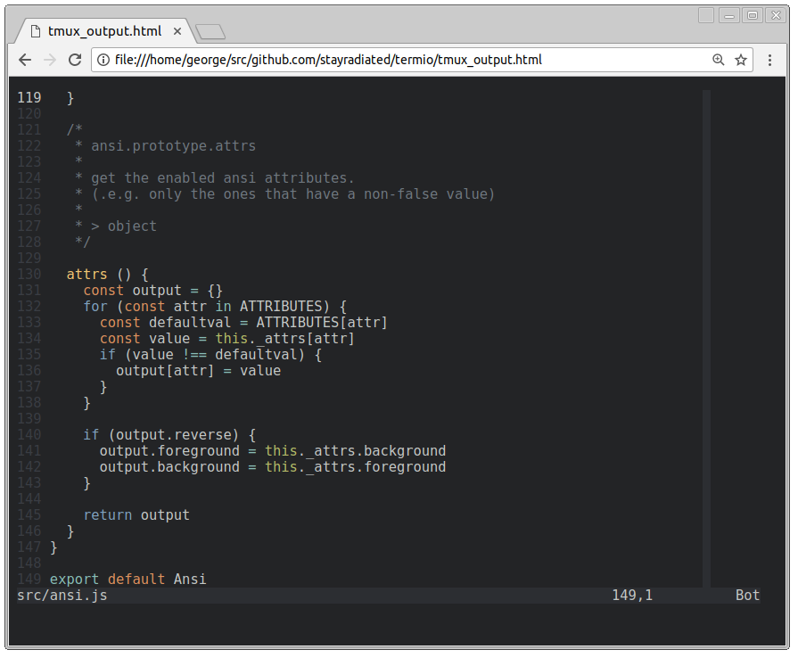

Termio
============

> Perfectly convert ANSI escape codes to HTML.



## Installation

```
npm install -g termio
```

## Terminal Usage

```
ls --color=always | termio > ls.html
```

### Capture data from TMUX

```
tmux capture-pane -eJ
tmux save-buffer tmux.output
termio < tmux.output > tmux.html
```

## JS API Usage

```javascript
const Termio = require('termio')

process.stdin
  .pipe(termio())
  .pipe(process.stdout)
```

## HTML Notes

- Everything is a `<span>`
- There are no inline `style` attributes. All styles must be applied with CSS.
  E.g. `<span class="foreground-1">`

## Supported SGR Codes

| Code | Class            | Effect
| ---- | ---------------  | ------
| 0    |                  | reset all styles
| 1    | `bold`           | use bold font and bright colors
| 2    |                  | *N/A*
| 3    | `italic`         | use italic font
| 4    | `underline`      | underline text
| 5    |                  | *N/A*
| 6    |                  | *N/A*
| 7    | `reverse`        | switch background and foreground colors
| 8    | `conceal`        | display nothing
| 9    | `strike`         | line through text
| ...  |                  |
| 21   |                  | remove bold
| 22   |                  | remove bold
| 23   |                  | remove italic
| 24   |                  | remove underline
| 25   |                  | *N/A*
| 26   |                  | *N/A*
| 27   |                  | remove reverse
| 28   |                  | remove conceal
| 29   |                  | remove strike
| 30   | `foreground-0`   | set foreground to 0
| 31   | `foreground-1`   | set foreground to 1
| 32   | `foreground-2`   | set foreground to 2
| 33   | `foreground-3`   | set foreground to 3
| 34   | `foreground-4`   | set foreground to 4
| 35   | `foreground-5`   | set foreground to 5
| 36   | `foreground-6`   | set foreground to 6
| 37   | `foreground-7`   | set foreground to 7
| 38   | `foreground-n`   | set foreground to n
| 39   | `foreground-fg`  | set foreground to fg
| 40   | `background-0`   | set background to 0
| 41   | `background-1`   | set background to 1
| 42   | `background-2`   | set background to 2
| 43   | `background-3`   | set background to 3
| 44   | `background-4`   | set background to 4
| 45   | `background-5`   | set background to 5
| 46   | `background-6`   | set background to 6
| 47   | `background-7`   | set background to 7
| 48   | `background-n`   | set background to n
| 49   | `background-bg`  | set background to bg
| ...  |                  |
| 90   | `foreground-8`   | set foreground to 8
| 91   | `foreground-9`   | set foreground to 9
| 92   | `foreground-10`  | set foreground to 10
| 93   | `foreground-11`  | set foreground to 11
| 94   | `foreground-12`  | set foreground to 12
| 95   | `foreground-13`  | set foreground to 13
| 96   | `foreground-14`  | set foreground to 14
| 97   | `foreground-15`  | set foreground to 15
| ...  |                  |
| 100  | `background-8`   | set background to 8
| 101  | `background-9`   | set background to 9
| 102  | `background-10`  | set background to 10
| 103  | `background-11`  | set background to 11
| 104  | `background-12`  | set background to 12
| 105  | `background-13`  | set background to 13
| 106  | `background-14`  | set background to 14
| 107  | `background-15`  | set background to 15
